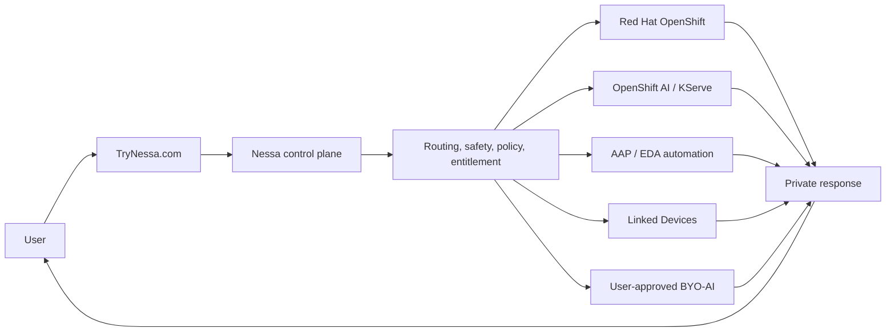

# Nessa AI Reference Architecture

Private family-focused AI platform patterns using Red Hat OpenShift, OpenShift AI, OpenShift Virtualization, Ansible Automation Platform, Event-Driven Ansible, AMD Strix Halo, Apple Silicon, Hugging Face model research, and disciplined staging-to-production validation.

This repository shares the architecture patterns, validation discipline, and platform lessons behind Nessa AI. It does not publish the TryNessa.com product source code or private implementation details.

Nessa AI is a private family-focused AI platform built around a simple principle: AI should help people learn, protect private work, and use user-controlled compute where possible.

> "Our goal is to help people do great things and improve humanity through AI."
>
> Matt Faust, 2026-05-03

## Why This Repo Is Different

This is not a slide-deck architecture sketch. It is a public-safe record of a real private AI platform that has been built, broken, benchmarked, repaired, and hardened over many production runs.

The architecture combines:

- a compact bare-metal OpenShift platform for the application, data, storage, automation, and release discipline
- a Strix Halo / AMD Ryzen AI Max+ 395 system with 128 GB unified memory as a real OpenShift AI worker node
- a MacBook Pro M5 Max with 128 GB unified memory as a private Apple Silicon Linked Device for OCR, AI Vision, image workflows, and high-memory model experiments
- a high-throughput Thunderbolt 5 / USB4 direct sideband between the Apple Silicon and OpenShift AI-worker lane
- a model lab that continuously evaluates Hugging Face candidates, GGUF builds, MLX builds, Ollama paths, `llama.cpp` paths, and OpenShift AI / KServe-style serving patterns

The goal is to show how a small team can build serious private AI infrastructure without pretending everything requires a rack-scale DGX appliance on day one.

## What This Repo Is

Public reference architecture for Nessa AI / TryNessa.com.

It documents:

- platform patterns that worked in a real OpenShift environment
- Red Hat product integration across OpenShift, OpenShift AI, OpenShift Virtualization, AAP, EDA, and ODF/Ceph
- private-AI inference lane design across cluster GPU, CPU fallback, Apple Silicon Linked Devices, and BYO-AI concepts
- validation discipline, staging-before-production release habits, browser proof expectations, and exact-digest promotion mindset
- public-safe family AI, Learning, OCR/vision, Linked Devices, and NessaClaw boundary patterns
- Smart Home patterns using Home Assistant as the open-source hub where practical
- mobile UX and generated-artifact continuity patterns for private AI products
- sanitized lessons from running a private AI product on real hardware

## Public Access Posture

TryNessa.com is public-facing as a free private AI product. Pro is invite/request-only through [trynessa.com/request-pro](https://www.trynessa.com/request-pro). Ultimate is coming soon.

The public reference architecture documents patterns and lessons. It is not a checkout funnel, billing implementation, or entitlement recipe.

## What This Repo Is Not

This is not the TryNessa.com product source code.

It intentionally does not publish:

- Secure Connector internals, pairing flows, protocols, tunnel mechanics, job schemas, or token handling
- tenant logic, production account flows, billing logic, user records, or private analytics
- private routing heuristics, premium model-selection rules, prompt chains, or product-specific safety bypass details
- Learning / Homework Buddy lesson-flow logic, worksheet parsers, anti-cheat behavior, or proprietary tutor-state mechanics
- live OpenShift topology, real route names, hostnames, IP addresses, credentials, database rows, configmaps, secrets, or private screenshots
- full NessaClaw execution recipes, tenant manifests, gateway tokens, raw OpenClaw access, or high-risk tool enablement steps

Public docs explain what was built, why it was built, what was validated, and what tradeoffs were learned. They do not expose the exact private recipe, connector internals, user data, routing heuristics, secrets, credentials, private network details, or proprietary Learning/Homework Buddy flows.

## Current Architecture Snapshot

The production product has evolved beyond the original CPU-first cluster. Current public-safe architecture themes include:

- OpenShift as the application, data, and operations platform
- OpenShift AI and KServe as model-serving and validation building blocks
- a dedicated Strix Halo / Ryzen AI Max+ 395 lane for local accelerated inference experiments and OpenShift-hosted serving
- Apple Silicon Linked Devices, including M3 Max as an earlier reference and M5 Max with 128 GB unified memory as the current high-memory private compute lane
- GPT-OSS 120B class experimentation on Apple Silicon with fail-closed route truth
- OCR and AI Vision emphasis on private Apple Silicon and vision-language model testing
- Smart Home as a simple household operations surface, with Home Assistant used where it helps connect real devices and a one-glance `House right now` answer before detailed cards
- Hugging Face model research with validation before promotion
- fail-closed privacy posture when a requested private route is unavailable
- NessaClaw as Nessa's guarded private agent-workspace surface over OpenClaw-compatible infrastructure, starting with safe missions and an always-visible stop control
- family-safe Learning and Homework Buddy principles without exposing lesson-flow implementation

Recent public-safe validation note, 2026-05-13: Nessa's private release process expanded into staging-only write-path, document, family-control, linked-device, security, mobile, Learning/Homework Buddy, model-governance, access/support/referral, response-quality, release-truth, canary, owner-notification, and weather-alert truth proof suites. The public lesson is simple: a private AI product needs proof for what users can save, delete, invite, upload, select, learn, resume, archive, regenerate, support, refer, administrate, read legally, and receive in production, not only proof that a model can answer. Public docs intentionally omit private routes, account data, connector internals, prompt chains, lesson-flow internals, billing internals, exact routing heuristics, private notification routes, private locations, and production test artifacts.

See [docs/21-quality-guardrails-and-write-path-validation.md](./docs/21-quality-guardrails-and-write-path-validation.md).
See also [docs/22-model-governance-and-admin-surface-guardrails.md](./docs/22-model-governance-and-admin-surface-guardrails.md).
See also [docs/23-access-support-and-donation-boundaries.md](./docs/23-access-support-and-donation-boundaries.md).
See also [docs/24-release-truth-and-canary-gates.md](./docs/24-release-truth-and-canary-gates.md).
See also [docs/25-owner-notification-trust-firewall.md](./docs/25-owner-notification-trust-firewall.md).
See also [docs/26-weather-alert-truth-gates.md](./docs/26-weather-alert-truth-gates.md).

## Hardware Lab at a Glance

| Hardware lane | Role | Excels At | Public-safe lesson |
|---|---|---|---|
| **Strix Halo / Ryzen AI Max+ 395, 128 GB** | OpenShift AI worker node | cluster-side inference, GGUF model tests, local NVMe model cache, OpenShift AI/KServe-style serving, multi-user service behavior | local AI becomes platform infrastructure when it joins OpenShift as a governed worker |
| **MacBook Pro M5 Max, 128 GB** | Apple Silicon Linked Device | OCR, AI Vision, MLX/Metal models, GPT-OSS 120B class tests, private image workflows | Apple Silicon is a strong private high-memory lane, especially for document/photo-heavy workflows |
| **Compact OpenShift nodes** | app/data/storage/control-plane baseline | routes, web/API replicas, PostgreSQL, ODF/Ceph, automation, fallback | specialized AI hardware works better when the platform underneath is already stable |

The Strix Halo unit and the M5 Max are complementary. The Strix Halo lane is the cluster-serving worker. The M5 Max lane is the private Apple Silicon endpoint. Thunderbolt 5 makes the lab workflow fast enough to move large artifacts and validation payloads without treating ordinary LAN paths as the bottleneck.

See [docs/14-hardware-and-model-lab.md](./docs/14-hardware-and-model-lab.md).

## Red Hat Technologies Used

- **Red Hat OpenShift**: platform foundation, routes, deployments, services, namespaces, operators, rollout discipline, and private application hosting.
- **Red Hat OpenShift AI**: model serving, KServe concepts, workbench and evaluation patterns, and model-lab validation.
- **Red Hat OpenShift Virtualization**: broader platform capability for VM workloads where private AI deployments need VM and container workloads side by side.
- **Red Hat Ansible Automation Platform**: operational automation, health snapshots, repeatable platform actions, and demo-friendly runbooks.
- **Event-Driven Ansible**: event-driven operations, release hooks, and alert or webhook response patterns.
- **ODF / Ceph**: durable storage patterns for platform state, document storage, workspace storage, and model-serving persistence.

Product names are used factually. This repository does not imply Red Hat endorsement of Nessa AI.

## Hardware and Inference Lanes

The reference architecture discusses several public-safe inference lanes:

- **OpenShift / Strix Halo lane**: cluster-side accelerated inference using a high-memory AMD Ryzen AI Max+ 395 / Strix Halo class node.
- **Apple Silicon Linked Device lane**: private user-approved compute on Apple Silicon, with M3 Max as a prior reference and M5 Max 128 GB unified memory as the current high-memory reference for OCR, vision, MLX/Metal, and GPT-OSS 120B class testing.
- **CPU historical lane**: a useful baseline for understanding why acceleration and routing discipline matter.
- **BYO-AI lane**: user-controlled external providers, only by explicit user choice and never as a silent fallback when privacy forbids it.

Apple Silicon Linked Devices are not OpenShift workers or KServe pods. They are private linked compute endpoints governed by Nessa policy and user approval.

## Model Lab and Hugging Face Workflow

Nessa treats model selection as an engineering loop, not a one-time download.

Public-safe model-lab steps:

1. find candidate models on Hugging Face, vendor docs, or open model announcements
2. check license, intended use, model card constraints, and artifact format
3. decide the likely lane: Strix Halo, Apple Silicon, CPU fallback, OpenShift AI/KServe, or BYO provider
4. test the actual runtime: Ollama, `llama.cpp`, MLX/Metal, or KServe-style serving
5. measure cold load, warm load, time-to-first-token, token cadence, task quality, OCR/vision behavior, and safety behavior
6. promote only after staging proof

Representative public-safe model families include Qwen, Qwen VL, Gemma, DeepSeek R1 distilled models, GPT-OSS 120B, FLUX/MLX image models, and embedding models. The current public Gemma 4 answer is `gemma4:26b` on the cluster lane, with `gemma4:e4b-mlx` tracked on the Apple Silicon / MLX lane.

See [docs/20-models-and-model-lab.md](./docs/20-models-and-model-lab.md), [docs/14-hardware-and-model-lab.md](./docs/14-hardware-and-model-lab.md), and [docs/11-benchmark-results.md](./docs/11-benchmark-results.md).

## Linked Devices and Private Compute

Linked Devices are a public-safe pattern for user-owned private compute:

- users approve whether a device participates
- the product should show health and readiness truthfully
- explicit selection should fail closed when unavailable
- premium or private labels must not silently fall back to a different route
- device and connector internals should not be published

See [docs/04-linked-devices-public-pattern.md](./docs/04-linked-devices-public-pattern.md) and [docs/05-secure-connector-public-boundary.md](./docs/05-secure-connector-public-boundary.md).

## Smart Home and Home Assistant

Nessa Smart Home is meant to answer simple household questions quickly:

- is the internet okay?
- are cameras and core devices reachable?
- what changed since the last check?
- can a parent see the important status without becoming a network engineer?

Home Assistant is the open-source smart-home project Nessa uses where practical as a hub and integration model. Nessa recognizes and links upstream projects plainly instead of presenting community work as Nessa-owned work.

See [docs/15-smart-home-and-home-assistant.md](./docs/15-smart-home-and-home-assistant.md).

## NessaClaw / OpenClaw-Compatible Private Agent Workspaces

NessaClaw is Nessa's guarded private agent-workspace surface.

OpenClaw is the upstream open-source project: https://github.com/openclaw/openclaw

NessaClaw adds the Nessa layer: authentication, entitlement, policy, storage, audit, safety, and kill-switch controls.

Public positioning:

- use **NessaClaw** for the Nessa product name
- use **OpenClaw** for the upstream project
- users interact with Nessa, not a raw OpenClaw route
- safe WebChat and read-only skills come first
- first paint should be three safe mission buttons plus an obvious stop button
- advanced controls should stay one tap away, not above the fold
- high-impact tools remain locked unless separately approved and validated

See [docs/09-nessaclaw-openclaw-compatible-workspaces.md](./docs/09-nessaclaw-openclaw-compatible-workspaces.md).
See also [docs/16-nessaclaw-design-philosophy.md](./docs/16-nessaclaw-design-philosophy.md).

## Learning and Family Safety Principles

Learning / Homework Buddy is a core product pillar. Public docs describe the philosophy, not the proprietary implementation.

The public pattern is:

- teach, do not only answer
- guide step by step
- preserve age and family appropriateness
- support worksheets, photos, and documents with privacy-first routing where possible
- treat trust failures as P0 defects
- anchor help to the specific visible problem and correct OCR/vision ambiguity before answering
- avoid publishing lesson-state schemas, prompt chains, parsers, anti-cheat logic, or tutor flow mechanics

See [docs/07-learning-and-family-safety.md](./docs/07-learning-and-family-safety.md) and [docs/FAMILY_AI_SAFETY_PATTERNS.md](./docs/FAMILY_AI_SAFETY_PATTERNS.md).

## Public-Safe Documentation Boundary

The short version:

- share ingredients, kitchen layout, safety rules, quality checks, and lessons learned
- do not share the secret recipe, proprietary timing, production credentials, full clone path, or commercially defensible implementation details

Start with [docs/00-public-scope-and-redactions.md](./docs/00-public-scope-and-redactions.md).

## Repo Map

Primary public reference docs:

- [docs/00-public-scope-and-redactions.md](./docs/00-public-scope-and-redactions.md)
- [docs/01-architecture-overview.md](./docs/01-architecture-overview.md)
- [docs/02-red-hat-stack.md](./docs/02-red-hat-stack.md)
- [docs/03-inference-lanes.md](./docs/03-inference-lanes.md)
- [docs/04-linked-devices-public-pattern.md](./docs/04-linked-devices-public-pattern.md)
- [docs/05-secure-connector-public-boundary.md](./docs/05-secure-connector-public-boundary.md)
- [docs/06-byo-ai-public-pattern.md](./docs/06-byo-ai-public-pattern.md)
- [docs/07-learning-and-family-safety.md](./docs/07-learning-and-family-safety.md)
- [docs/08-ocr-ai-vision-public-pattern.md](./docs/08-ocr-ai-vision-public-pattern.md)
- [docs/09-nessaclaw-openclaw-compatible-workspaces.md](./docs/09-nessaclaw-openclaw-compatible-workspaces.md)
- [docs/10-validation-and-release-discipline.md](./docs/10-validation-and-release-discipline.md)
- [docs/11-contributing.md](./docs/11-contributing.md)
- [docs/12-license-and-attribution.md](./docs/12-license-and-attribution.md)
- [docs/14-hardware-and-model-lab.md](./docs/14-hardware-and-model-lab.md)
- [docs/15-smart-home-and-home-assistant.md](./docs/15-smart-home-and-home-assistant.md)
- [docs/16-nessaclaw-design-philosophy.md](./docs/16-nessaclaw-design-philosophy.md)
- [docs/17-hardware-and-model-lab.md](./docs/17-hardware-and-model-lab.md)
- [docs/18-camera-ux-design.md](./docs/18-camera-ux-design.md)

Diagrams:

- [docs/diagrams/nessa-reference-architecture.md](./docs/diagrams/nessa-reference-architecture.md)
- [docs/diagrams/inference-lanes.md](./docs/diagrams/inference-lanes.md)
- [docs/diagrams/linked-devices-pattern.md](./docs/diagrams/linked-devices-pattern.md)
- [docs/diagrams/nessaclaw-boundary.md](./docs/diagrams/nessaclaw-boundary.md)

Supplemental sanitized historical docs and examples:

- `docs/03-core-only-phase.md` through `docs/13-cost-analysis.md`
- `docs/FAMILY_AI_SAFETY_PATTERNS.md`
- `examples/openshift`
- `examples/aap`
- `examples/notebooks`

## Contributing

Useful contributions include docs improvements, diagrams, benchmark-harness improvements, public-safe Red Hat/OpenShift patterns, sanitized examples, and typo fixes.

Do not submit secrets, private topology, production configuration, account data, connector internals, raw route dumps, customer screenshots, bypass techniques, or requests to expose proprietary product logic.

See [docs/11-contributing.md](./docs/11-contributing.md).

## License and Attribution

This repository is licensed under the Apache License 2.0. It covers only the public-safe reference architecture materials, examples, diagrams, and documentation in this repository.

It does not publish or license the private TryNessa.com product source code, Secure Connector internals, production configuration, tenant logic, private routing heuristics, account flows, proprietary Learning/Homework Buddy implementation, secrets, credentials, or private infrastructure.

Nessa recognizes the open-source projects it builds around or integrates with, including Home Assistant and OpenClaw. NessaClaw is Nessa's guarded product surface; OpenClaw remains the upstream project. Smart Home uses Home Assistant where practical; Home Assistant remains its own open-source project. Preserve upstream license notices when third-party material is copied or adapted.

Red Hat, OpenShift, OpenShift AI, OpenShift Virtualization, Ansible Automation Platform, Event-Driven Ansible, and related marks are trademarks of Red Hat, Inc. Product names are used factually.

See [docs/12-license-and-attribution.md](./docs/12-license-and-attribution.md).

## Security / Responsible Disclosure

Do not open public issues with secrets, private route names, user data, connector tokens, authentication material, exploit details, or bypass recipes.

For sensitive reports, contact the maintainer privately through the channels listed on the public Nessa sites.

## Links

- [TryNessa.com](https://TryNessa.com)
- [NessaAi.com](https://NessaAi.com)
- [NessaBot.com](https://NessaBot.com)
