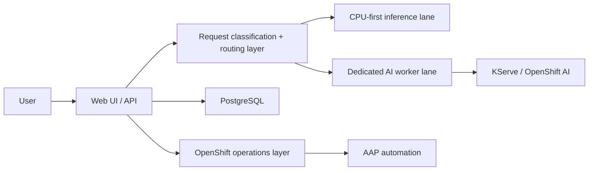

# Core-Based OpenShift for Private AI Apps

This public repository documents how we brought a private AI chat application onto OpenShift using modest CPU-first hardware, and what changed when we later added a single AMD Strix Halo worker for accelerated inference.

The material here is based on real production work from a private SaaS project, but it has been deliberately sanitized.

What this repo is for:
- showing how a compact OpenShift cluster can run a real AI application before you buy large GPU systems
- explaining what worked well on CPU-centric or low-power nodes
- documenting the practical value of adding one stronger AI worker later
- giving operators reusable patterns for OpenShift AI, KServe, AAP, storage, rollout discipline, and observability

What this repo is not:
- a dump of our private production repo
- a full copy of our inference routing or application logic
- a disclosure of proprietary scheduling, device-sharing, agent, billing, encryption, or data-handling internals

## Repo Map
- [docs/01-repo-scope-and-redactions.md](./docs/01-repo-scope-and-redactions.md)
- [docs/02-reference-architecture.md](./docs/02-reference-architecture.md)
- [docs/03-core-only-phase.md](./docs/03-core-only-phase.md)
- [docs/04-application-patterns-on-openshift.md](./docs/04-application-patterns-on-openshift.md)
- [docs/05-openshift-ai-and-aap.md](./docs/05-openshift-ai-and-aap.md)
- [docs/06-adding-a-strix-halo-worker.md](./docs/06-adding-a-strix-halo-worker.md)
- [docs/07-lessons-learned.md](./docs/07-lessons-learned.md)
- [docs/08-next-hardware-options.md](./docs/08-next-hardware-options.md)
- [docs/09-operations-checklist.md](./docs/09-operations-checklist.md)
- [docs/10-known-constraints.md](./docs/10-known-constraints.md)
- [examples/openshift/README.md](./examples/openshift/README.md)
- [examples/aap/README.md](./examples/aap/README.md)
- [examples/notebooks/README.md](./examples/notebooks/README.md)

## Executive Summary
We started with a compact OpenShift cluster built on low-power x86 mini PCs where control-plane and worker roles were combined. That phase proved a few important things:
- a real AI chat application can run on OpenShift before you own premium GPU hardware
- CPU-first inference can be good enough for small prompts, basic summaries, and application bootstrap work
- OpenShift primitives matter more than fancy hardware at the beginning: clean rollouts, right-sized limits, health checks, storage discipline, and good logs pay off immediately

The next big jump came from adding one AMD Strix Halo system as a dedicated AI worker.

That changed the platform in three important ways:
- it gave us a dedicated inference lane without destabilizing the compact core cluster
- it improved latency and consistency for longer prompts and larger models
- it created a credible OpenShift AI and KServe story for demos, experimentation, and future scale-out

## High-Level Architecture

## Why Publish This
A lot of public AI infrastructure content jumps from laptop demos straight to multi-GPU racks. We wanted a more honest middle ground:
- what a compact OpenShift cluster can actually do
- where it starts to strain
- how one stronger AI node changes the equation
- what we would buy next and why

## Key Takeaways
1. Start with a stable platform before chasing model size.
2. Keep the application architecture simple enough to observe under load.
3. Treat logging and rollout safety as product features.
4. Add one stronger inference worker before building a large heterogeneous fleet.
5. Use OpenShift AI and AAP to improve repeatability, not just to check a feature box.

## Intended Audience
- OpenShift operators who want to run a private AI app at home or in a lab
- engineers evaluating whether CPU-first OpenShift can host a useful LLM-backed product
- teams planning a first dedicated AI worker
- people who want a practical bridge between homelab experimentation and production habits
