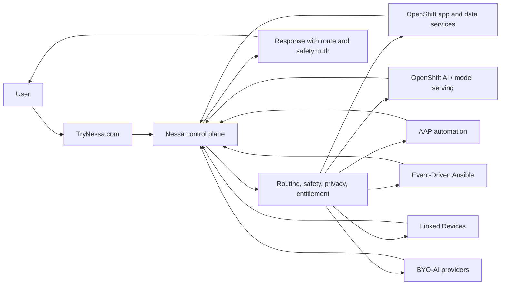

# Architecture Overview

## Purpose

This document describes the public-safe TryNessa AI platform architecture. It is intentionally high level. It explains the control-plane shape, Red Hat platform roles, inference lanes, validation posture, and privacy boundaries without publishing TryNessa.com product source code or private implementation details.

## Conceptual Flow

## Layered Architecture

### User and product layer

TryNessa.com is the product entry point. The product layer owns user experience, authentication, family context, Learning workflows, document workflows, Smart Home surfaces, NessaClaw, and visible trust boundaries.

This repo does not publish product implementation.

### Nessa control plane

The Nessa control plane mediates safety, privacy, account posture, routing, and workflow boundaries. It decides whether a request is allowed, blocked, approval-gated, or routed to a private compute lane.

The private decision logic is not published.

### Platform layer

OpenShift provides the application platform:

- web/API deployments
- internal services
- route and health semantics
- namespace isolation
- deployment and rollout control
- storage integration
- operational observability

### AI and automation layer

OpenShift AI, AAP, and EDA provide reusable platform roles:

- model-serving and evaluation concepts
- workbench and model-lab patterns
- automation runbooks
- event-driven release and operations hooks

### Compute lanes

Nessa can reason about several public-safe compute patterns:

- OpenShift-hosted inference
- OpenShift AI / KServe serving
- CPU fallback
- Strix Halo / Ryzen AI Max+ 395 accelerated worker lane
- Apple Silicon Linked Devices, including a MacBook Pro M5 Max 128 GB high-memory lane
- BYO-AI providers when explicitly chosen

The Strix Halo and Apple Silicon lanes solve different problems. Strix Halo is the OpenShift worker-node pattern for cluster-side inference. Apple Silicon is the private Linked Device pattern for MLX/Metal, OCR, AI Vision, image workflows, and high-memory local model experiments.

See [14-hardware-and-model-lab.md](./14-hardware-and-model-lab.md).

## Red Hat Product Roles

### OpenShift

OpenShift is the platform foundation. It hosts application services, internal APIs, worker placement, route health, rollout control, storage claims, and operational checks.

### OpenShift Virtualization

OpenShift Virtualization is part of the broader platform option when VM workloads need to live beside container workloads. This repo discusses it as an architectural fit, not as a TryNessa.com implementation dump.

### OpenShift AI

OpenShift AI provides model-serving, workbench, KServe, model-registry, and evaluation concepts. Nessa uses these patterns where private model serving or repeatable validation matters.

### Ansible Automation Platform

AAP provides repeatable platform operations, health snapshots, release checks, and demonstration-friendly automation.

### Event-Driven Ansible

EDA supports event-driven operations, alert handling, release hooks, and platform-response loops.

### ODF / Ceph

ODF/Ceph provides durable storage patterns for platform state, documents, workspaces, logs, and model-serving support. Public docs avoid sensitive capacities, topology, and live storage object names.

## Design Principles

- The user talks to Nessa, not directly to raw infrastructure.
- Private routing must fail closed when privacy requires it.
- Backend proof alone is not enough for user-facing changes.
- Staging proves first; production receives the exact verified artifact.
- Red Hat platform primitives are useful when paired with evidence discipline.
- Public docs should explain the architecture without publishing the product clone path.
- Model claims should be validated on the real lane: Strix Halo, Apple Silicon, CPU fallback, OpenShift AI/KServe, or explicit BYO provider.
