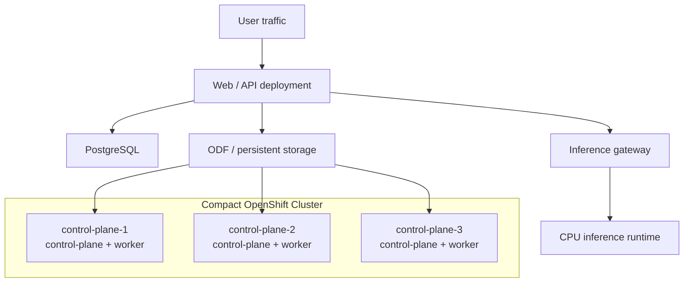
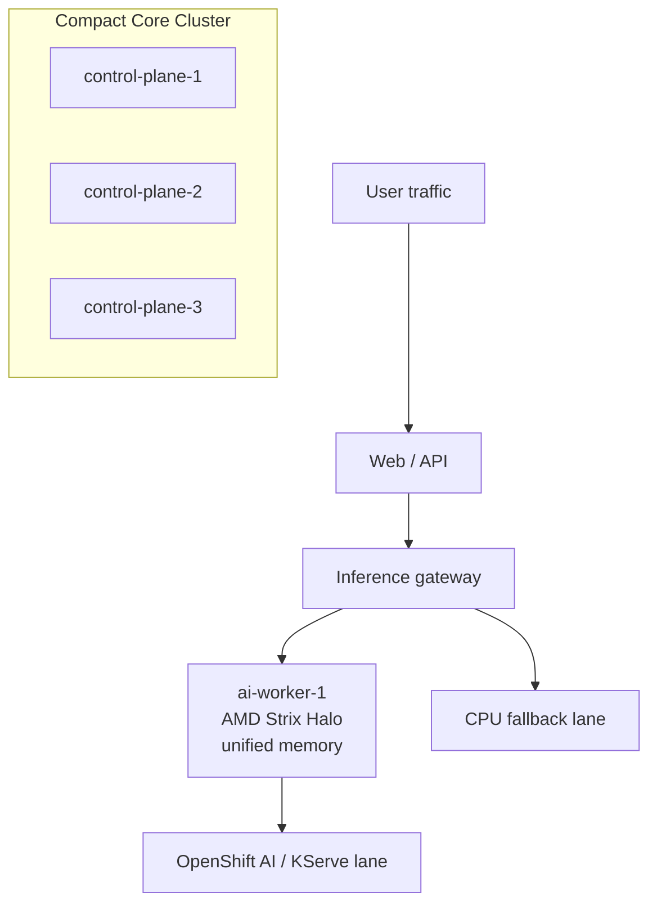

# Reference Architecture

## Phase 1: Compact Core-Based OpenShift
The initial environment used three compact x86 systems running a small OpenShift cluster where control-plane and worker responsibilities were combined.

That approach worked because it optimized for:
- low cost
- realistic home-lab power and noise constraints
- operational simplicity
- enough redundancy to survive application failures and routine maintenance

## Baseline Topology

## What Ran in the Core-Only Phase
A practical minimum set looked like this:
- web/UI and API service
- a lightweight background worker or operations service
- PostgreSQL
- a small inference gateway or model proxy
- a fallback model-serving runtime
- persistent storage
- routes, autoscaling, and disruption budgets

## Why This Architecture Worked Early
This shape worked well for early-stage product development because it let us:
- validate the end-user experience before buying bigger hardware
- build discipline around rollout safety and observability
- learn what application latency was due to software versus hardware
- keep operations understandable

## Where It Started To Hurt
The combined control-plane/worker design has real limits:
- memory pressure matters more because the same nodes carry both cluster services and app workloads
- large inference pods can create misleading overcommit warnings
- upgrades are more sensitive to poor PDBs and drain behavior
- storage and inference experiments can interfere with each other if not separated carefully

## Phase 2: Add One Dedicated AI Worker
After the core-only phase, we added a single stronger worker specifically for model serving.

That changed the cluster shape:

## Design Principle
Keep the core cluster stable first. Add acceleration second.

The biggest architectural win was not raw speed by itself. The win was separating heavy AI serving from the compact core nodes so the platform became easier to reason about.
