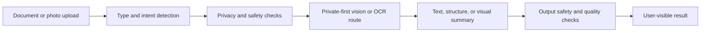

# OCR and AI Vision Public Pattern

## Purpose

This document describes public-safe OCR and AI Vision architecture patterns for TryNessa AI. It does not publish bypass details, classifier thresholds, hidden prompts, exact OCR repair heuristics, or private user content.

## Intake Pattern

Public-safe flow:

## Privacy Principles

- Use private routes where possible.
- Treat family, child, and school content as sensitive.
- Avoid exposing raw uploaded content in logs or public docs.
- Keep document identity, account identity, and private route detail out of public examples.
- Make failures honest when OCR or vision confidence is weak.

## AI Vision Safety Pattern

Useful public layers:

- input file validation
- document or photo classification
- private-first routing
- extraction or description
- output safety review
- user-visible uncertainty where needed

For generated images, public lessons include:

- no-people-by-default can reduce hidden unsafe output risk for scenery, object, vehicle, pet, food, and interior prompts
- prompt safety is not enough by itself
- output safety and asset binding matter before display
- unsafe prompts should block before generator use

## Apple Silicon Vision Lane

The Apple Silicon Linked Device lane became especially important for OCR and AI Vision.

Public-safe reasons:

- Apple unified memory makes larger local vision-language experiments practical.
- MLX / Metal paths are a strong fit for Apple Silicon.
- A private user-approved endpoint can keep family, worksheet, photo, and document content on local hardware when policy and readiness allow it.
- Vision failures can remain honest instead of pretending OCR succeeded.
- Private route labels must fail closed if the selected device or model is unavailable.

In this architecture, the MacBook Pro M5 Max 128 GB lane is the high-memory Apple Silicon reference. It is treated as a Linked Device, not an OpenShift worker.

## Strix Halo Vision and Cluster Role

The Strix Halo / Ryzen AI Max+ 395 worker is still important to OCR and AI Vision, but its best role is different.

It is stronger as:

- an OpenShift-hosted inference worker
- a place to test GGUF and vision-language candidates that fit the validated runtime
- a controlled cluster-side fallback or comparison lane
- a platform for repeatable model-serving experiments

The architecture lesson is to avoid forcing every OCR or vision task through the same machine. Some vision workloads fit Apple Silicon better. Some model-serving experiments fit the OpenShift worker better. The control plane should make that route decision privately and fail honestly when the right lane is unavailable.

## Model Families Tracked for Vision

The public model-lab story includes model families such as:

- Qwen VL and Qwen3-VL candidates for document/photo understanding and OCR research
- smaller local vision models for fast private fallback behavior
- MLX-friendly image and vision builds on Apple Silicon
- Strix-friendly GGUF candidates when the runtime and quantization fit the OpenShift worker lane

This repository does not publish private model-selection heuristics, prompt chains, worksheet parsers, OCR repair logic, or route scoring.

## Redaction Pattern

Before publishing OCR or vision examples:

- remove user names, emails, and account IDs
- remove children or family details
- remove real documents unless explicitly public
- remove route names and storage IDs
- remove private image outputs unless fully sanitized

## What Is Not Published

This repo does not publish:

- safety bypass details
- raw classifier thresholds
- exact OCR repair heuristics
- hidden prompts
- image-generation guard internals
- real family, child, or user content
- private generated image examples
- document IDs or storage paths
