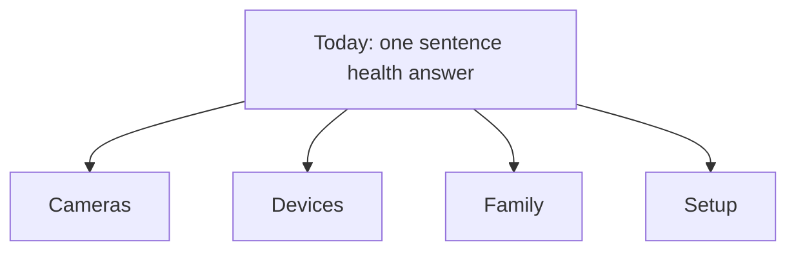

# Camera UX Design Pattern

Public reference architecture note: this page describes the design pattern only. It intentionally omits private device names, network addresses, hostnames, usernames, paths, credentials, and routing details.

## Calm Smart Home Structure

Smart Home works best when the first screen answers the user's question before it shows controls:

The default tab is `Today`. It carries the plain-language status line and the top few items that need attention. Detailed cards move into `Devices`. Camera previews move into `Cameras` so they do not consume battery or network while the user is only checking the home summary.

## Live Tiles

Camera tiles use a low-cost snapshot loop, not a decoder-heavy stream on every card. A tile starts only when the Cameras tab is active and the tile is visible. Hidden tabs and off-screen tiles pause automatically.

Fullscreen viewing is a separate mode. Clicking a tile promotes that camera into a larger player through the private camera proxy, where the app can offer pause, snapshot, recording lookup, and capability-detected controls.

## Recording Vault

Recording history is exposed as a read-only server-side proxy pattern. The browser asks the application for a camera/day index, and the server resolves storage access privately. Browser responses contain filenames and playback links only; they do not expose storage hosts, usernames, filesystem roots, credentials, or private routing.

The important principle is that camera and recording controls should feel simple without becoming fake. The UI can be calm because the proxy, authorization, path validation, and pause/resume behavior do the careful work behind it.
