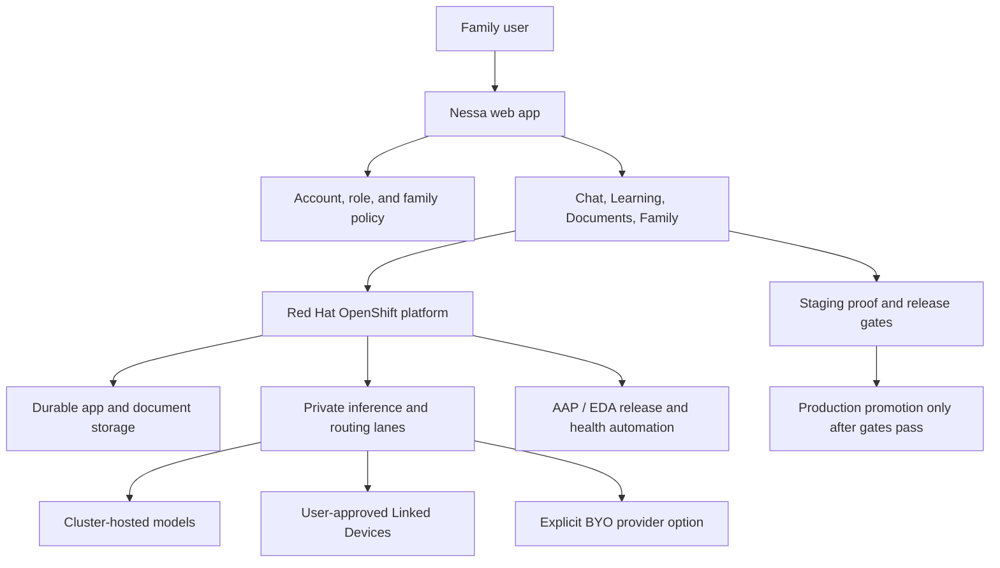

# Public Demo and Marketing Pack

This pack is the public-safe story for Nessa AI: private family AI on OpenShift, useful daily workflows, and disciplined proof before promotion.

It is meant for demos, public GitHub readers, founder walkthroughs, and technical conversations. It intentionally avoids private accounts, live routes, hostnames, IP addresses, cluster UUIDs, internal prompts, proprietary lesson-state logic, connector internals, screenshots from private users, and security-sensitive operational detail.

## One-Sentence Positioning

Nessa is private AI for real family life: homework help, document safety, family controls, and user-approved private compute on a governed OpenShift platform.

## Public Landing Page Message

Hero:

> Private AI for real family life.

Support copy:

> Nessa helps families learn, understand documents, protect sensitive details, and use private compute where it is available.

Proof cards:

| Card | Public-safe promise | Boundary |
|---|---|---|
| Homework help | Nessa checks a student's thinking, anchors to the right problem, and teaches the next step. | Do not expose proprietary tutor prompts, anti-cheat logic, or private worksheet artifacts. |
| Document safety and redaction | Nessa can summarize, search, redact, and export documents while keeping final artifacts in the user's workspace. | Do not claim deletion or privacy behavior stronger than the backend policy. |
| Private compute | Linked Devices can help with eligible private workloads when healthy and approved. | Do not expose connector protocols, device IDs, private routes, or silent fallbacks. |
| Family controls | Family roles shape what learners, adults, and owners can see or do. | Do not publish private roster data, invite tokens, or entitlement internals. |
| Nessa Now | The home experience should stay calm: ask Nessa first, then show only a few real things needing attention. | Do not show fake dashboard data or stale session links. |

## Sanitized Architecture Diagram

## Why Nessa Is Different

Nessa is not positioned as a generic chatbot skin. The differentiator is the combination of private-family product thinking and serious platform discipline:

- homework help is anchored to the visible problem, not stale canned hints
- documents are treated as private artifacts with redaction and retention truth
- family roles affect the experience instead of being a billing label only
- Linked Devices are user-approved private compute, not hidden infrastructure magic
- release gates test real user workflows before promotion
- owner notifications are deduplicated and action-oriented instead of noisy
- weather, maintenance, and platform status copy must be source-backed

## OpenShift Overview

The public story is "private family AI on OpenShift."

OpenShift provides:

- routed web/API services
- operator-managed platform components
- durable storage patterns
- separate staging and production validation
- observability and health checks
- room for OpenShift AI, OpenShift Virtualization, AAP, EDA, and storage services to work together

The public lesson is not that every family product needs the same hardware. The lesson is that private AI becomes more trustworthy when product features, platform health, and release gates are managed together.

## Linked Devices Concept

Linked Devices are a user-facing idea: approved personal or household compute can help Nessa with eligible workloads.

Public-safe rules:

- show friendly device readiness, not raw identifiers
- use private compute only when the path is healthy and allowed
- fail closed or explain fallback honestly
- keep normal chat usable without special cables or local devices
- hide advanced model and device details from children and Basic users

See [04-linked-devices-public-pattern.md](./04-linked-devices-public-pattern.md).

## Learning / Homework Buddy Principle

The Learning principle is simple: check the student's thinking first.

For a worksheet-backed algebra turn, Nessa should:

- resolve the problem number or equation the student is asking about
- tolerate misspellings like "promblem 2"
- validate what the student got right
- correct the specific mistake
- keep teaching policy appropriate for the learner's role
- never reuse a stale hint from another problem

Public demos may show synthetic worksheet problems. Do not use private student sessions or screenshots.

See [32-tutor-intent-anchor-reasoning-guardrails.md](./32-tutor-intent-anchor-reasoning-guardrails.md) and [33-study-companion-learning-pattern.md](./33-study-companion-learning-pattern.md).

## Documents and Redaction Trust Principle

Documents are trust-sensitive. The public story should emphasize real behavior:

- upload and reload must preserve the document
- search and summary must use the uploaded artifact
- redaction must create a downloadable result and audit trail
- generated assets must have honest names and file sizes
- document counts must agree across surfaces
- unsupported or oversized files need clear copy
- deletion and retention claims must match backend behavior

See [08-ocr-ai-vision-public-pattern.md](./08-ocr-ai-vision-public-pattern.md) and [30-nvme-scratch-worker-pattern.md](./30-nvme-scratch-worker-pattern.md).

## AAP / EDA Release-Gate Lessons

The public lesson from automation is not "send more alerts." It is "send better proof."

Useful release and operations messages include:

- what changed
- why it matters
- owner action needed, or "No action"
- proof source or run id
- severity with reason
- temporary-state expiration when relevant

Repeated non-actionable deploy noise should collapse into a digest. Failed production gates, rollback, security leaks, and customer-impacting outages should still page immediately.

See [24-release-truth-and-canary-gates.md](./24-release-truth-and-canary-gates.md), [25-owner-notification-trust-firewall.md](./25-owner-notification-trust-firewall.md), and [28-release-runbook-truth-sync.md](./28-release-runbook-truth-sync.md).

## Dual-Sideband Hardware Lesson

The public hardware lesson is intentionally modest:

- two direct workstation-to-AI-node links should be measured separately
- do not pretend two links become one guaranteed wider pipe
- use sideband paths only for eligible large payloads
- keep normal Kubernetes, auth, billing, and chat traffic on the supported network path
- show "dual sideband active" only when both paths are healthy and the current job used them

This is a product-truth lesson, not a private routing recipe.

See [29-dual-sideband-transfer-pattern.md](./29-dual-sideband-transfer-pattern.md).

## Demo Entry Points

Clean public demo path:

1. Open the public landing page.
2. Use guest/free flow only.
3. Start with chat or a synthetic worksheet/document.
4. Avoid private owner menus, admin pages, production dashboards, logs, notifications, and cluster consoles.
5. If a route requires auth, use a seeded public demo user only when the account contains synthetic data.

The demo should prove product quality, not expose operations.

## Related Materials

- [39-public-demo-scripts.md](./39-public-demo-scripts.md)
- [40-public-demo-gallery-and-launch-checklist.md](./40-public-demo-gallery-and-launch-checklist.md)
