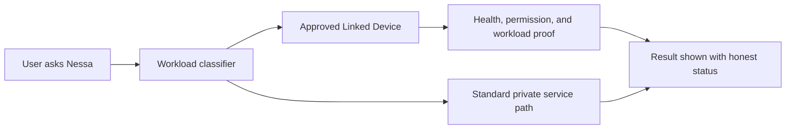

# Public Demo Gallery and Launch Checklist

This gallery contains synthetic demo material that is safe for public walkthroughs. It should be used instead of private screenshots, private accounts, real family documents, real homework sessions, or production console views.

## Demo Gallery

### 1. Public-Safe Worksheet

Title: Algebra Practice Snapshot

Problems:

1. Solve: `x^2 + 5 = 2`
2. Solve: `v^2 - 4 = 12`
3. Complete the square: `y^2 - 3y - 18 = 0`
4. Factor: `a^2 - 9`

Demo prompt:

> For problem 2, I think v squared equals 16 because 16 - 4 = 12. Is my answer 4?

Expected answer pattern:

- references problem 2
- confirms that adding 4 gives `v^2 = 16`
- corrects the final answer to `v = 4` or `v = -4`
- does not mention problem 1
- does not repeat a stale hint

### 2. Public-Safe Document Redaction

Synthetic document:

> Maple Street Robotics Club field trip form
>
> Student: Jordan Example
>
> Parent email: parent@example.test
>
> Phone: 555-0100
>
> Pickup note: Jordan can be released to Taylor Example after 4:30 PM.
>
> Payment: $12 cash due Friday.

Redaction request:

> Summarize this form and create a redacted version safe to share with another parent.

Expected redacted output:

> Maple Street Robotics Club field trip form
>
> Student: [STUDENT NAME]
>
> Parent email: [EMAIL]
>
> Phone: [PHONE]
>
> Pickup note: [AUTHORIZED PICKUP DETAIL]
>
> Payment: $12 cash due Friday.

Expected summary:

- field trip form
- payment is due Friday
- pickup details exist but should not be shared broadly

### 3. Public-Safe Linked Device Explanation

Short version:

> Linked Devices let a user-approved computer help Nessa with eligible private workloads, such as OCR, vision, large artifacts, or model experiments. If the device is offline or unavailable, Nessa should say so clearly or use the standard path. It should not expose raw device identifiers or silently pretend a private route was used.

Demo-safe visual:

### 4. Public-Safe Nessa Now Explanation

Short version:

> Nessa Now should stay calm. The default home is chat first, then at most a few truthful items that need attention. It should never become an operations dashboard for a family user.

Safe example attention items:

- Continue Algebra Practice
- Review one recent document
- Family settings are active

Unsafe demo items:

- private session ids
- stale lesson snippets
- raw model names
- raw device ids
- platform alert internals

## Launch Checklist

### Safe To Show

- public landing page
- public reference architecture repository
- synthetic worksheet and document examples
- sanitized architecture diagrams
- guest/free product flow
- high-level OpenShift, OpenShift AI, AAP, EDA, and storage patterns
- Linked Devices concept without internals
- release-gate lessons without private run artifacts
- screenshots from synthetic demo accounts only

### Must Remain Private

- production accounts, rosters, chat history, documents, generated assets, and screenshots
- hostnames, private routes, IP addresses, cluster UUIDs, and node names
- secrets, tokens, API keys, invite links, session cookies, and auth bypasses
- Secure Connector internals and pairing mechanics
- proprietary prompts, routing heuristics, lesson-state schemas, and anti-cheat logic
- production logs, notification destinations, owner contact methods, and platform alert URLs
- billing internals and entitlement mutation routes

### Owner Acceptance Checklist

Before public use, verify:

- landing page uses "Private AI for real family life"
- proof cards are Homework Help, Document Safety/Redaction, Private Compute, Family Controls, and Nessa Now
- demo starts from a clean guest/free path or synthetic demo account
- no private screenshot/account/data is present
- no private hostnames, routes, IPs, tokens, or cluster identifiers appear
- Linked Devices are described as optional and user-approved
- dual-sideband hardware is described as measured eligible-payload acceleration, not a guaranteed wider pipe
- document privacy/deletion/redaction claims match real backend behavior
- family and learner safety claims are phrased as product principles, not impossible guarantees
- release-gate claims link to public-safe docs and do not expose private run artifacts
