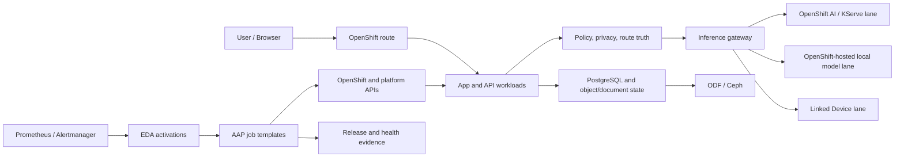

# Red Hat Platform Deep Dive

Last updated: 2026-06-04

This page explains how the Red Hat platform pieces fit together in the public Nessa AI reference architecture:

- Red Hat OpenShift
- Red Hat OpenShift AI
- Red Hat Ansible Automation Platform
- Event-Driven Ansible
- OpenShift Virtualization
- ODF / Ceph storage
- governed MTP and model-serving lanes

It intentionally omits private routes, hostnames, IP addresses, node names, account data, tokens, production manifests, exact routing heuristics, prompt chains, private automation credentials, and internal proof artifacts.

## Operating Model

Nessa treats the Red Hat stack as a platform, not as a collection of disconnected tools.

The important boundary is that each layer has a job:

| Layer | Public-safe role | Should not become |
|---|---|---|
| OpenShift | Application, data, route, rollout, resource, storage, and operator foundation | A place to hide unclear app behavior |
| OpenShift AI | Model-serving, workbench, KServe, registry, and evaluation plane | The owner of product UX, auth, or safety policy |
| AAP | Repeatable operational jobs and scheduled maintenance | A replacement for normal app release engineering |
| EDA | Event-to-runbook bridge for bounded external signals | A dumping ground for stale or periodic jobs |
| ODF / Ceph | Durable platform and application state | Hot model cache for every workload |
| OpenShift Virtualization | VM workloads beside containers when that is the right boundary | A reason to split operations into two estates |
| MTP lanes | Preview or high-deliberation acceleration after proof | A default route just because a direct benchmark looked fast |

## OpenShift Foundation

OpenShift was the foundation because private AI needs ordinary production discipline before model-serving gets interesting.

Useful OpenShift responsibilities:

- separate production, staging, automation, notebook, and supporting workload namespaces
- make routes, services, probes, and rollout status visible release gates
- keep web/API, inference gateway, model runtime, scratch worker, and data roles separate enough to debug
- use StatefulSets/PVCs for durable state and Deployments for replaceable app/runtime components
- make resource requests realistic so upgrades, drains, and disruption budgets keep working
- use node placement deliberately for AI workers, storage-heavy workloads, and compact control-plane nodes
- treat staging parking as a platform state, including HPA/PDB/resource cleanup, not only "scale web to zero"

Two public-safe lessons stood out:

1. A cluster can have plenty of real RAM and still fire overcommit alerts if requests are poorly shaped.
2. A parked staging namespace can create false critical PDB alerts if its PodDisruptionBudgets still require unavailable pods.

That is why the reference pattern favors measured requests, explicit AI-worker placement, and scripts that park staging completely, including PDB state.

## OpenShift AI

OpenShift AI contributed the governed model-serving and evaluation plane.

Useful responsibilities:

- KServe-style serving objects for cluster-hosted model lanes
- workbenches for repeatable demos, benchmarks, and validation notebooks
- model registry and lifecycle concepts for "candidate", "validated", and "promoted" model states
- evaluation pipelines that can run before a routing or model-serving change is promoted
- a clean platform story for serving models on a dedicated AI worker instead of overloading app pods

The app still owns:

- authentication
- user experience
- family and child policy
- privacy class
- response-mode labels
- fallback behavior
- final answer persistence

OpenShift AI should make model serving inspectable. It should not decide what a child can access, whether a private route may fall back externally, or whether a user-facing control should be visible.

## KServe and Context Contracts

A model endpoint is not ready just because the pod is running.

Public-safe KServe / serving checks:

- predictor readiness
- actual model readiness, not only open socket readiness
- node placement and accelerator backend proof
- context-window agreement between callers and backend runtime
- prompt-token and response-token budget alignment
- warm/cold behavior
- fallback behavior when the endpoint is unavailable

The context-window lesson is especially important for RAG and tool-using systems. If an assistant, tool layer, or platform service budgets for a larger context than the backend runtime actually exposes, normal prompts can fail even though the model is healthy. The fix is not only "increase context"; the fix is to declare and enforce the same context contract on both sides.

## AAP

Ansible Automation Platform worked best as a repeatable operations and proof layer.

Useful AAP job types:

- cluster health snapshots
- operator and route checks
- pre-demo validation
- post-deploy verification
- storage and model-serving readiness checks
- golden-image or VM-image maintenance
- product-surface audits
- owner-approved access or environment actions with a visible audit trail

AAP should have clear Prompt on Launch behavior. If a template uses a survey, the launch screen should ask the real business questions. An empty raw variables screen before the survey is a broken operator experience, even when the backend playbook still works.

Good AAP templates have:

- a clear name
- a clear survey when human input is needed
- safe defaults
- idempotent behavior
- `changed=0` diagnostic modes when appropriate
- a readable final summary
- no secret values in stdout

## EDA

Event-Driven Ansible is useful when there is a real event.

Good EDA fits:

- Alertmanager webhook to bounded runbook
- release webhook to deployment gate
- Git or CI event to audit job
- product-surface event to health or validation template
- owner notification event to a controlled automation path

Weak EDA fits:

- weekly maintenance with no event pressure
- one-shot diagnostics that stay running forever
- rulebooks that duplicate an existing scheduled Controller job
- activations with no successful event history
- stale webhook Services pointing at deleted activation pods

The public pattern is simple: if a workflow is periodic maintenance, schedule it in AAP. If a workflow is truly event-driven, use EDA, but keep the activation observable and keep its Service selector synced to the live activation pod.

## Scheduled AAP vs EDA

Use this decision table:

| Workflow shape | Better fit | Why |
|---|---|---|
| Weekly image refresh | AAP schedule | Time-based, auditable, no always-on listener required |
| Alert arrives from Alertmanager | EDA to AAP | Real event, bounded response |
| Pre-release health snapshot | AAP job | Operator-triggered proof |
| Deployment gate webhook | EDA to AAP | Event-driven release transition |
| Failed stale activation with zero events | Retire or rebuild | Visible failure noise is worse than no automation |
| Demo content generation with survey input | AAP job template | Human input, repeatable artifact |

This avoids a common trap: using EDA because it is available rather than because the workflow is actually event-driven.

## OpenShift Virtualization

OpenShift Virtualization matters because real private AI environments often contain both containers and VMs.

Useful roles:

- controlled VM workloads beside app namespaces
- golden-image maintenance
- test or isolation VMs
- guest-agent workflows where VM state needs controlled handling
- shared operations visibility through OpenShift

The main lesson is that VMs still participate in cluster operations. Resource requests, drain behavior, live migration, and golden-image maintenance affect the same platform that serves the app. Treat VM density and memory-request policy as first-class platform design, not as a separate side project.

## ODF / Ceph

ODF/Ceph is the durable storage plane.

Good uses:

- PostgreSQL and application state
- document and artifact storage
- workspace state
- object storage
- storage-backed platform services

Less good uses:

- every hot model cache
- large frequently rewritten temporary model artifacts
- scratch workloads that can live on local high-throughput storage

The public lesson is to separate application truth from model cache. Durable state wants resilience. Hot model cache wants throughput, locality, and quick rebuild paths.

## MTP Through The Platform

Multi-token prediction should move through the same platform maturity path as any other model-serving lane.

Recommended progression:

1. prove the runtime directly
2. prove the accelerator backend and model artifact are actually MTP-capable
3. measure a fair comparison against the current lane
4. prove the gateway path without fallback contamination
5. prove the full app path: streaming, finalization, persistence, policy, and browser UX
6. expose owner/admin preview
7. expose a high-deliberation lane such as Thinking
8. keep Auto off or canary-limited until quality, latency, and idle-cost data justify broader routing

OpenShift-hosted Strix Halo class hardware is useful because it makes local AI a governed cluster-serving lane. Apple Silicon Linked Devices are useful because they provide high-memory private endpoint compute. They are complementary, not interchangeable.

MTP is not "fast model magic." It is a runtime, artifact, gateway, app-route, and product-contract problem.

## Release And Proof Loop

The full platform loop looks like this:

1. Build or configure the candidate lane.
2. Prove low-level health.
3. Prove app-route behavior in staging.
4. Run workflow-specific gates.
5. Promote the exact image digest or config that passed.
6. Run read-only canary checks in production.
7. Check logs and alerts after rollout.
8. Update docs with what was actually proved.
9. Remove or retire stale automation that creates false failure noise.

The strongest public lesson from the Nessa platform is that operational truth and product truth must agree. A model lane is not ready when the benchmark passes. It is ready when the user path, platform path, automation path, and proof artifacts all say the same thing.

## Common Failure Modes

| Failure | Public-safe fix |
|---|---|
| Model endpoint ready but context too small | Align caller and backend context contracts |
| Staging parked but PDB still requires pods | Park PDB state with workload state |
| AAP template opens on empty variables | Use survey-only launch UX for human prompts |
| EDA activation failed with no events | Rebuild if needed or retire if scheduled AAP is the real workflow |
| AI worker carries unrelated workloads | Add placement rules and verify after rollout |
| Direct MTP benchmark passes but app route fails | Keep preview disabled until gateway and browser proof pass |
| Model cache competes with durable storage | Move hot cache to the appropriate local/cache tier |
| Production canary creates state | Make canary read-only or isolate and clean test state |

## What To Publish And What To Keep Private

Safe to publish:

- product/platform responsibility boundaries
- sanitized lifecycle diagrams
- validation methods
- generic YAML fragments
- decisions such as "scheduled AAP beats stale EDA for periodic maintenance"
- high-level MTP rollout standards
- public-safe model family and hardware-class lessons

Keep private:

- exact object names from a live cluster
- real hostnames, routes, IP addresses, node names, and account IDs
- tokens, secrets, credential names, and private repositories
- exact routing heuristics and prompt chains
- private Learning, document, Smart Home, and NessaClaw implementation details
- production screenshots and raw proof artifacts

## Related Pages

- [02-red-hat-stack.md](./02-red-hat-stack.md)
- [03-inference-lanes.md](./03-inference-lanes.md)
- [04-application-patterns-on-openshift.md](./04-application-patterns-on-openshift.md)
- [05-openshift-ai-and-aap.md](./05-openshift-ai-and-aap.md)
- [20-models-and-model-lab.md](./20-models-and-model-lab.md)
- [24-release-truth-and-canary-gates.md](./24-release-truth-and-canary-gates.md)
- [41-owner-only-linked-device-mtp-preview.md](./41-owner-only-linked-device-mtp-preview.md)
- [45-learning-mission-control-and-native-mtp-rollout.md](./45-learning-mission-control-and-native-mtp-rollout.md)
