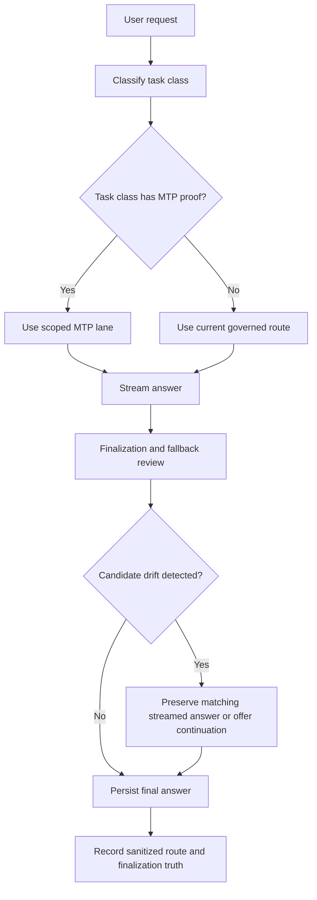

# Story Finalization and Scoped Auto-MTP

Last updated: 2026-06-25

This note captures a public-safe pattern for two related production lessons:

- long creative generations must not change into a different story during finalization
- Multi-Token Prediction (MTP) should enter Auto mode only as a scoped, proof-gated capability

It intentionally omits private chat URLs, prompts, account data, message ids, database rows, model filenames, private route names, production digests, raw logs, hostnames, and implementation thresholds.

## Why This Matters

For a private family AI product, a long answer is not complete just because the stream produced a lot of text.

The final saved answer must still match the user's requested premise, task type, privacy boundary, and visible completion state. If a finalization step replaces a streamed answer with a longer fallback that changes the protagonist, setting, topic, or task, the product feels dishonest even if the replacement is well written.

This is especially important for:

- stories and creative writing
- factual long-form answers
- code and plans
- Learning / Homework Buddy explanations
- document summaries and rewrites
- preview or accelerated inference lanes

The public lesson is simple: finalization is part of the product contract, not an invisible cleanup step.

## Finalization Contract

Long generation should preserve the best answer that matches the request, not the longest answer available.

Reusable checks:

- keep the streamed answer as a first-class candidate
- compare postprocessed or fallback text against the original task intent
- reject candidates that introduce unrelated protagonists, settings, named entities, or task types
- reject candidates that leak continuation scaffolding, prompt-control text, or fallback templates
- prefer a shorter matching answer over a longer drifting answer
- persist the exact final text the user saw or a clearly repaired version with proof
- remove or refresh stale retrieval chunks when an in-place repair changes stored assistant content

For creative writing, the validator should treat story premise, named subject, setting, genre, and requested length as continuity signals. For factual or document answers, it should treat topic, evidence scope, and instruction leakage as continuity signals.

## Fallback Acceptance

Fallbacks are candidates, not automatic winners.

A robust answer engine should evaluate fallback text before accepting it:

| Candidate type | Accept when | Reject when |
|---|---|---|
| Streamed answer | It matches the user request and reached a usable ending | It is empty, clearly truncated, unsafe, or visibly broken |
| Postprocessed answer | It improves clarity while preserving task intent | It changes the task, characters, topic, or requested format |
| Offline fallback | It is prompt-aware and matches the requested premise | It is generic, seeded from an unrelated scenario, or longer only because it drifted |
| Continuation repair | It continues from the actual prior text | It restarts, introduces unrelated scaffolding, or changes the answer class |

The useful rule is not "never use a fallback." The rule is "fallbacks must pass the same continuity and safety contract as primary generations."

## Scoped Auto-MTP Pattern

MTP can be strong enough to join normal Auto mode, but only after the product path proves it for the specific task class being routed.

Public-safe rollout pattern:

1. Prove the MTP runtime directly.
2. Prove the gateway path without silent fallback.
3. Prove the full app route with browser-visible streaming and final-message persistence.
4. Enable MTP first for the task classes that passed, such as bounded reasoning or code tasks.
5. Keep long creative writing, document work, Learning, and other specialized lanes on their existing routes until separate proof exists.
6. Record sanitized route truth, fallback truth, first-token behavior, stream finish, and finalization state.
7. Keep child/restricted policy, owner/admin eligibility, and private-compute boundaries intact.

The important distinction is task-scoped Auto, not global Auto. A single successful MTP path should not automatically take over every request category.

## Single-Slot Runtime Caution

Some MTP runtimes or deployments are effectively single-slot from a product perspective. That can be acceptable for deliberate tasks, but it is risky for broad Auto traffic.

Before widening MTP routing, validate:

- concurrency behavior under realistic app traffic
- whether long tasks monopolize the lane
- queue and timeout behavior
- fallback honesty when the lane is busy
- user-visible first-token latency
- whether unrelated Auto requests are delayed

If long creative or document tasks can occupy the lane and delay ordinary requests, keep those task classes out of Auto-MTP until the runtime, queueing, and fallback story are proved.

## Canary And Release Proof

MTP and finalization changes should use the same release discipline as other user-facing runtime changes.

Public-safe proof should include:

- focused regression tests for drift and fallback acceptance
- staging proof on the exact candidate artifact
- browser proof for streaming and final persisted content
- route-scope proof that eligible tasks use MTP and ineligible tasks stay on normal routes
- canary proof with production-matching resources
- production proof after exact artifact promotion
- recent log review for fallback, timeout, and persistence errors
- documentation updates that state what was and was not proved

Canary resources should match production closely enough to make the canary meaningful. A canary-only worker, memory, or process-count mismatch can create false failures or false confidence.

## Public Boundary

Public docs can share the pattern:

- preserve premise through finalization
- treat fallback as a candidate
- use drift checks for long creative and factual work
- scope Auto-MTP by task class
- keep full app-route proof ahead of broader rollout
- document limitations truthfully

Public docs should not share:

- private chat URLs or message ids
- real user prompts or private family content
- database repair commands or production rows
- exact model filenames, private route names, or route scoring
- connector protocols, tokens, hostnames, IPs, or logs
- fallback thresholds or hidden prompt templates

## Public Lesson

The strong product pattern is:

1. generate the answer
2. keep the streamed answer as evidence
3. accept only final candidates that still match the request
4. route MTP in Auto only for proven task classes
5. prove the full app path, not just the model benchmark
6. publish sanitized lessons while keeping private implementation details private

This extends the broader patterns in [41-owner-only-linked-device-mtp-preview.md](./41-owner-only-linked-device-mtp-preview.md), [42-private-answer-engine-governed-routes.md](./42-private-answer-engine-governed-routes.md), and [49-response-quality-golden-pack.md](./49-response-quality-golden-pack.md).
