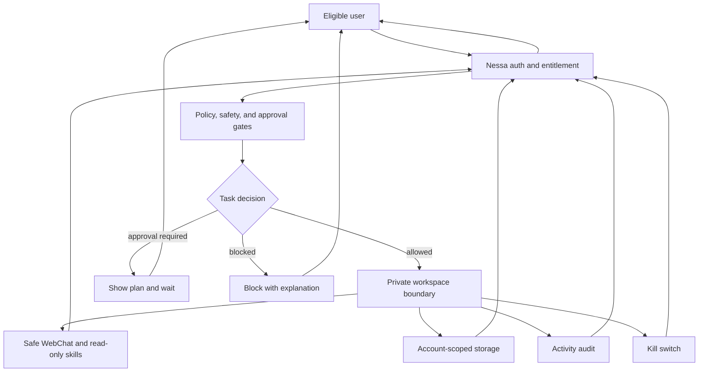

# NessaClaw Boundary Diagram

> **Archived capability pattern:** NessaClaw is not part of the current ordinary-user TryNessa offer. This diagram is retained for possible future owner-only requalification. See [../CURRENT_PRODUCT_BOUNDARY.md](../CURRENT_PRODUCT_BOUNDARY.md).

This diagram shows the public-safe NessaClaw boundary. It does not expose tenant manifests, tokens, raw gateway routes, private canary IDs, or high-risk tool enablement recipes.

